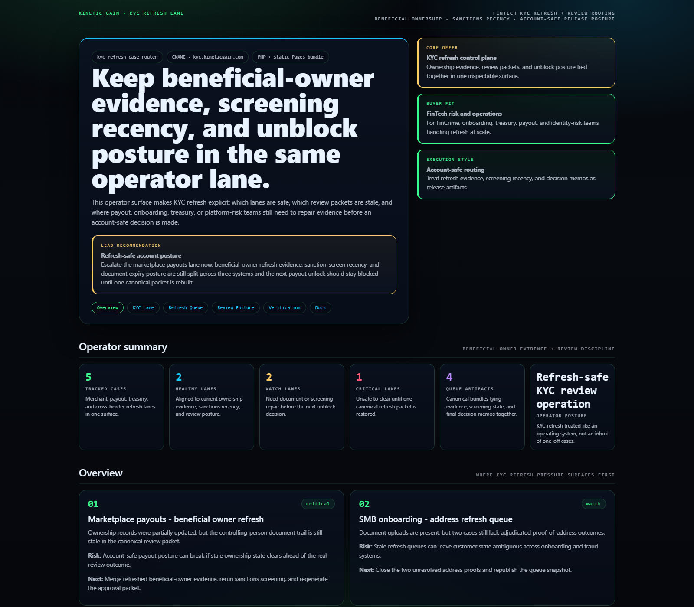
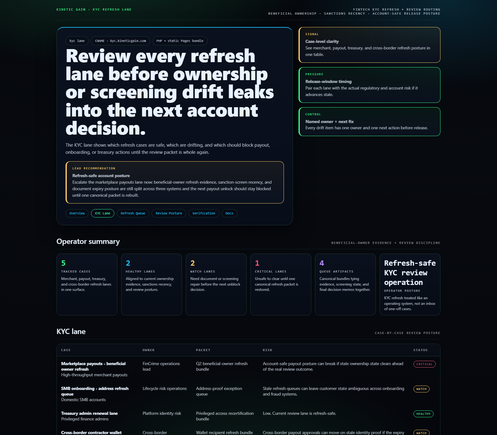
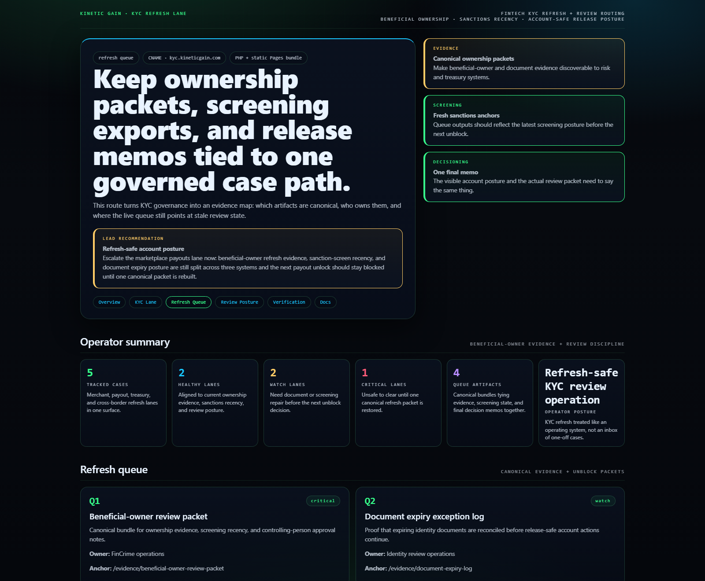
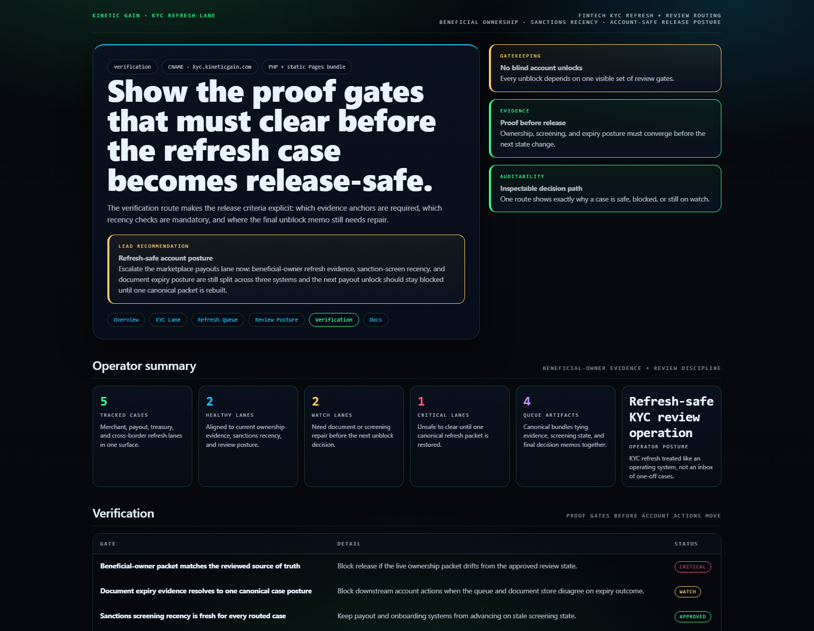

# KYC Refresh Case Router

WordPress and FinTech control plane for KYC refresh routing, beneficial-owner evidence, review packets, and account-safe remediation posture.

## Why this exists

- FinTech review teams usually split beneficial-owner refreshes, sanctions recency, document expiry checks, and unblock memos across too many tools.
- Risk, treasury, onboarding, and payout teams need one view of which KYC lanes are safe, which packets are stale, and which refresh artifacts still block release.
- Account-safe decisioning breaks when the queue, the review packet, and the final unblock memo all say different things.

## Why this matters (KG Embedded tie-back)

This repo demonstrates the KYC-refresh primitive for Kinetic Gain Embedded: beneficial-owner evidence, sanctions recency, unblock posture, and review-safe routing exposed through one operator surface. In a real embedded setting, the same primitive lets FinTech teams keep refresh workflow, payout decisions, and identity-risk review aligned without shipping account changes blindly.

## Product depth

KYC Refresh Case Router turns identity-review drift into an account-safe decision packet. It gives FinCrime, onboarding, treasury, payout, platform-risk, and executive stakeholders one shared view before stale beneficial-owner packets, screening recency gaps, document expiry, or weak unblock memos create release risk.

- Non-technical leaders see which accounts are unsafe to advance and why.
- Technical and operations teams see the data contract: cases, lanes, refresh artifacts, screening recency, verification gates, and review posture.
- go-to-market teams can explain identity governance, fewer payout holds, and safer onboarding decisions without hand-waving the operating layer.

## What these repos have in common

- **Risk, owner, proof, next action:** each surface turns a messy operational domain into a compact decision lane that leaders, operators, and technical teams can inspect together.
- **Representative data, no live secrets:** the repos use synthetic records and public-safe evidence shapes only. No account, customer, bank, processor, credential, or production KYC data belongs in the public proof surface.
- **Buyer-readable GTM:** the same page has to make sense to a founder, CFO, compliance lead, product owner, engineer, and investor reviewer without requiring a private walkthrough.
- **Evidence before claims:** every route points back to concrete artifacts, gates, and review posture so the story is inspectable rather than just positioned.

## Operating workflow

1. Model the refresh lane: capture account cohort, owner, evidence packet, screening posture, and release pressure in one record.
2. Score the release posture: separate healthy, watch, and blocked cases before payout, treasury, or onboarding teams move the account forward.
3. Route the decision: turn the case into a defensible unblock, repair, or escalation path with one visible owner and next action.

## Routes

- `/`
- `/kyc-lane`
- `/refresh-queue`
- `/review-posture`
- `/verification`
- `/docs`

## API

- `/api/dashboard/summary`
- `/api/kyc-lane`
- `/api/refresh-queue`
- `/api/verification`
- `/api/sample`

## Screenshots






## Local development

```powershell
cd kyc-refresh-case-router
php -S 127.0.0.1:5442 .\router.php
```

Open:
- [http://127.0.0.1:5442/](http://127.0.0.1:5442/)
- [http://127.0.0.1:5442/kyc-lane](http://127.0.0.1:5442/kyc-lane)
- [http://127.0.0.1:5442/refresh-queue](http://127.0.0.1:5442/refresh-queue)
- [http://127.0.0.1:5442/review-posture](http://127.0.0.1:5442/review-posture)
- [http://127.0.0.1:5442/verification](http://127.0.0.1:5442/verification)

## Validation

- `php -l public\index.php`
- `php -l src\Services\KycRefreshCaseRouterService.php`
- `php -l src\Views\render.php`
- `php -l plugin\kyc-refresh-case-router.php`
- `php scripts\run_demo.php`
- `php scripts\prerender.php`
- `powershell -ExecutionPolicy Bypass -File .\scripts\smoke_check.ps1`
- `powershell -ExecutionPolicy Bypass -File .\scripts\render_readme_assets.ps1`

## Production status

| Aspect | Status |
|--------|--------|
| License | [AGPL-3.0-or-later](./LICENSE) |
| Security | [SECURITY.md](./SECURITY.md) |
| Deploy | Static prerender -> **https://kyc.kineticgain.com/** |
| WordPress primitive | KYC refresh snapshot shortcode + REST route |

## Docs

- [Architecture](./docs/architecture.md)
- [Origin](./docs/ORIGIN.md)
- [Kinetic Gain Embedded tie-back](./docs/KINETIC_GAIN_EMBEDDED.md)
- [Changelog](./CHANGELOG.md)

## Part of the Kinetic Gain Suite

Operator surface in the [Kinetic Gain Suite](https://suite.kineticgain.com/) — a portfolio of buyer-readable control planes spanning compliance evidence, FinTech risk, property operations, identity posture, and operator workflows. Apex: [kineticgain.com](https://kineticgain.com/).
